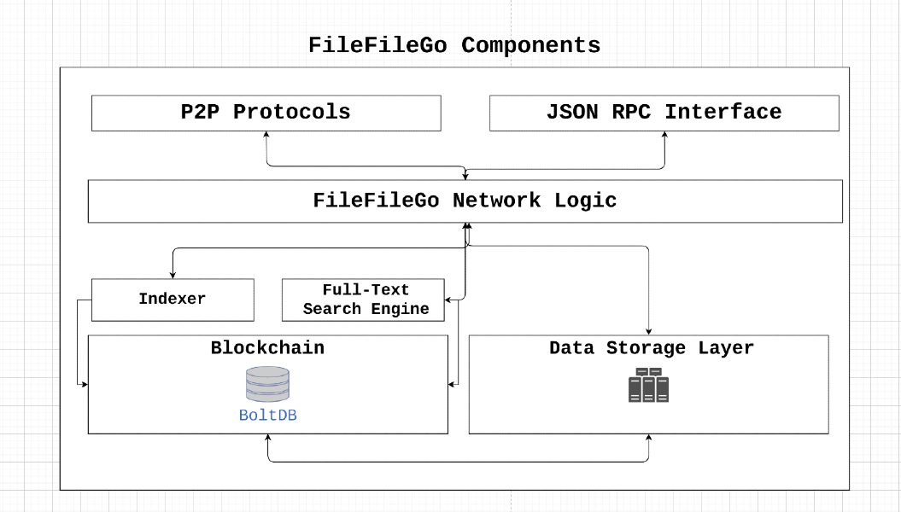

# FileFileGo Decentralized Network

A Peer-to-peer data sharing network with indexing/tracking, storage, full-text search and incentive mechanism form a decentralized network that allow users share data without a single point of failure and censorship. The architecture should be designed in a way to prevent censorship and privacy issues, improve data availability with an incentive system based on game-theory concepts, and achieve fault-tolerance. We propose a Peer-to-peer and decentralized data sharing network (FileFileGo) for the web3 era.

We have seen the rise of the Internet from the first days until now. Open internet suffers from big corporations and ISPs which censor freedom of speech. We have seen acts and statements such as SOPA, PIPA, ACTA and so many more from law-makers with the goal of controlling the Internet and the flow of information.

These days it's extremely difficult for sites like WikiLeaks, thepiratebay, and so on to operate without interruption and pressure from different oppressing parties. With these in mind, we have developed the FileFileGo protocol and stacks to allow users access and share data without a single point of failure.

# Installation

### Linux, macOS, and FreeBSD based systems

#### Install requirements

1. Download and install golang

```
https://golang.org/doc/install
follow the instructions to install golang on your system
```

#### Compile FileFileGo for Linux, macOS, and FreeBSD

1. Download and Compile:

```
git clone https://gitlab.com/filefilego/filefilego.git
cd filefilego/cli
go build -o filefilego .
```

2. Create Node Identity Key (Used for encryption and network identification)
   Replace **thisismynodespassword** with your own password

```
./filefilego account create_node_key thisismynodespassword
```

3. Create an account to send/receive coins.
   Replace **thisismypassword** with your own password

```
./filefilego account create thisismypassword
```

4. List the created accounts:

```
./filefilego account list

You will get json filenames which contains the address of your created account in step 3.
0x--------------------------------.json
```

5. Run the full node:

```
./filefilego --rpc --http --httpport=8090 --httpaddr=0.0.0.0 --bootstrapnodes="/ip4/77.247.178.110/tcp/10209/p2p/16Uiu2HAm1WKH57E4vku2rhLT3qMtP6GX5t5CxxoSmQnJWMHc6Lot"
```

The above command runs a full node and starts the http rpc server. In this case we listen on all interfaces `0.0.0.0` and port `8090` so we can build application which can interact with this full node.

### Windows

#### Install requirements for Windows

1. Install Go for windows

```
https://golang.org/dl/

Download: go1.14.4.windows-amd64.msi
and install the package
```

2. Install TDM-GCC

In order to compile the code on windows we need gcc. Download the TDM-GCC installer by visiting this page:

```
https://jmeubank.github.io/tdm-gcc/

Download tdm64-gcc-x.x.x.exe if you are on a 64-bit machine
-- or ---
Download tdm-gcc-9.2.0.exe if you are on a 32-bit machine

Most of modern CPUs are 64-bit based so go for the first binary
```

#### Compile FileFileGo for Windows

1. Download and Compile:
   Open a windows cmd/terminal and follow the instructions(use `dir` to navigate to your desired folder e.g. `C:/FileFileGo`):

```
git clone https://gitlab.com/filefilego/filefilego.git
cd filefilego/cli
go build -o filefilego.exe .
```

2. Create Node Identity Key (Used for encryption and network identification)
   Replace **thisismynodespassword** with your own password

```
filefilego.exe account create_node_key thisismynodespassword
```

3. Create an account to send/receive coins.
   Replace **thisismypassword** with your own password

```
filefilego.exe account create thisismypassword
```

4. List the created accounts:

```
filefilego.exe account list

You will get json filenames which contains the address of your created account in step 3.
0x--------------------------------.json
```

5. Run the full node:

```
filefilego.exe --rpc --http --httpport=8090 --httpaddr=0.0.0.0 --bootstrapnodes="/ip4/77.247.178.110/tcp/10209/p2p/16Uiu2HAm1WKH57E4vku2rhLT3qMtP6GX5t5CxxoSmQnJWMHc6Lot"
```

# Architecture

In this section we cover the disadvantages of different protocols and platforms to get a more clear picture and examine the weaknesses.

### XDCC

XDCC is a file sharing method which is based on IRC to serve files.

| **XDCC Disadvantages**                                                                                   |
| -------------------------------------------------------------------------------------------------------- |
| Requires a centralized indexer/tracker/lister which is subject to censorship and single point of failure |
| Transfer protocol rather than a complete file sharing solution                                           |
| No built-in search functionality                                                                         |
| No incentive to retain data                                                                              |

### Usenet

Usenet is a distributed discussion system since 1980.

| **Usenet Disadvantages**                                                                                               |
| ---------------------------------------------------------------------------------------------------------------------- |
| Requires a centralized indexer/tracker/lister which is subject to censorship and single point of failure               |
| Requires subscription and forces user to pay - ( what if only one single file is needed?!)                             |
| Although Usenet providers retain data, it still lacks the incentive mechanism which motivates them to retain even more |

### BitTorrent

BitTorrent is a peer-to-peer file sharing protocol which requires a client and trackers/DHT.

| **BitTorrent Disadvantages**                                                                              |
| --------------------------------------------------------------------------------------------------------- |
| Requires a centralized indexer/tracker/lister which is subject to censorship and single point of failure  |
| Inactive Torrents without seeders/Lack of incentive mechanism to reward peers for seeding                 |
| IP addresses are completely exposed. Anyone can see what user is downloading and uploading                |
| (Optional) Requires additional VPN and proxy services which are paid services, to solve the above problem |
| Penalty by ISPs for downloading files, usually require users to pay up to USD 200 - USD 5000              |
| Unstable download/upload speed                                                                            |

### Cyberlocker / Filehoster

A cyberlocker is a third-party online service that provides file-storing and file-sharing services.

| **Cyberlocker / Filehoster Disadvantages**                                                               |
| -------------------------------------------------------------------------------------------------------- |
| Requires a centralized indexer/tracker/lister which is subject to censorship and single point of failure |
| The Filehoster on its own is subject to censorship. (e.g megaupload was shut down by DOJ)                |
| Requires subscription and premium upgrades - ( what if only one single file is needed?!)                 |
| Extremely slow speeds which force users to pay for premium account                                       |
| Inactive files are deleted after a few months / Lack of incentive mechanism                              |

## FileFileGo Components



### Features

FileFileGo combines the strength of Usenet, Blockchain/Cryptocurrency, DHT and some innovations behind Torrent to form a decentralized network that can't be censored and taken down by ISPs.

- Blockchain-based for indexing, tracking, and other network metadata and logic.
- Encrypted traffic to prevent ISPs and other third parties from traffic inspection.
- Privacy-first design, to relay traffic through a set of intermediate peers.
- The peer-to-Peer design which replicates the state of the network on each full-node.
- Native cryptocurrency to work as the "fuel" of the network.
- Extremely low transaction fees compared to Ethereum/Bitcoin.
- Dynamic block size.
- Block-time of 10 seconds.
- RPC interface to build DApps.

### Consensus Algorithm

Block-time of 10 seconds require an appropriate consensus algorithm which doesn't waste much processing power and is efficient enough to process high volume of transactions. For the first phase of FileFileGo we choose to use Proof of Authority to achieve consensus and later on a PoS mechanism will replace the current algorithm. PoW based algorithms are risky (PoW is safe by design) for new blockchains since there are already huge pools of computing power out there and can be used to perform 51% attacks.

#### Proof of Authority / Validator+Verifier Algorithms

Validator's identities are hardcoded within the blockchain and can be verified by the Genesis block coinbase transaction. The verification by participating nodes is a simple process of checking the blocks signatures.

#### Proof of Stake

In future, proof-of-stake will eventually replace the current PoA mechanism so different parties can participate in the block mining process. In terms of blockchain governance we want more parties and developers to get involved and increase the stakeholders, and one of the incentive is the Proof-of-Stake mechanism.

### Blockchain and Metadata/Accounting

When it comes to transaction and state mutation, we choose different approach from UTXO-like structures, to elliminate complexity. In FileFileGo accounting and metadata are stored like a normal database row while the raw blocks are stored in original format within the database.

# Technical Details

In this section we will introduce technical terms and concepts used in FileFileGo.

### Channels

Channels allow users to organize and group data. Its similar to a bucket or folder. For example all the content on Wikileaks can be placed within a channel called "Wikileaks".
The channel creator inherits all the permissions required for updates and other channel related functionalities.

###

# Crypto-Economics Specification

| Unit                     | Value in Aran                     |
| ------------------------ | --------------------------------- |
| **Aran**                 | **1**                             |
| **Karan**                | **1.000**                         |
| **Maran**                | **1.000.000**                     |
| **Garan**                | **1.000.000.000**                 |
| **Microzaran**           | **1.000.000.000.000**             |
| **Milizaran**            | **1.000.000.000.000.000**         |
| **Zaran** (Default unit) | **1.000.000.000.000.000.000**     |
| **Kzaran**               | **1.000.000.000.000.000.000.000** |

**Total Supply:** 500 Million Zarans
**Validation/Stake Reward:** 15 Zarans per Block
**Supply Decrease Rate:** Devide by 2 every 24 months
